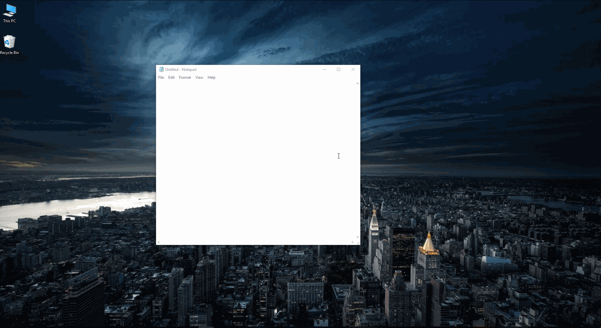

# ahk-windowgrid
Extend the default keyboard shortcuts for moving windows, doubling the number of screen columns.

Uses [AutoHotKey](https://www.autohotkey.com/) and is used by pressing <kbd>CTRL</kbd>+<kbd>WIN</kbd>+<kbd>Arrows</kbd>.

### Demonstration: 

